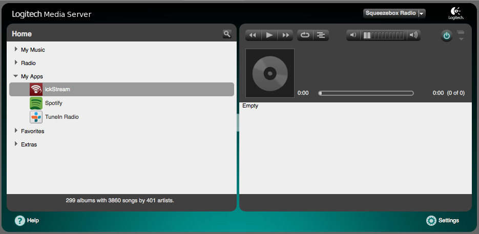

# About

The intention with the Open Beta for Squeezebox is to give all early
adopters within the Squeezebox community a chance to access ickStream
services and share feedback. The Open Beta for Squeezebox only contains
a limited set of all features offered by the ickStream Music Platform,
it is however fully functional and it gives you a preview of how
streaming services are integrated via ickStream and can be made
available to hardware players such as the Logitech Squeezebox.

The Open Beta for Squeezebox is provided as-is and we do not guarantee
any specific functionality or suitability for a specific purpose. We do
reserve the right to change or withdraw any functionality provided, even
completely, at any time. We do not guarantee access to certain services
or capabilities until the launch of the first production release.

# What's included

The open beta for Squeezebox consists of the following parts

  - A plugin for LMS (Logitech Media Server) which provides
      - An "ickStream" menu under the "My Apps" menu on your Squeezebox
        which allows you to browse content in the integrated streaming
        services
      - Ability to search in the integrated streaming services
      - Ability to play content from the integrated streaming services
  - The following streaming services are integrated
      - Calm Radio (http://calmradio.com)
      - UberStations (http://uberstations.com)
      - Deezer (http://www.deezer.com)
      - Qobuz (http://www.qobuz.com)
      - rad.io (http://www.rad.io)
      - Radionomy (http://www.radionomy.com)
      - SoundCloud (http://www.soundcloud.com)
      - WiMP (http://www.wimpmusic.com)
      - TIDAL (http://tidalhifi.com)

ickStream provides access to promotions and voucher codes for music
services periodically, for more information visit our [wiki page about
promotions.](Open_Beta_Squeezebox_Promotions "wikilink")

# Who is allowed to use it

The Open Beta for Squeezebox is only allowed for personal use with
Squeezebox hardware devices, a Squeezebox-compatible smartphone player
App or on general-purpose PCs or do-it-yourself devices. It does
explicitly NOT grant you the right to use ickStream on any other
commercial media player hardware. If you have a commercial device you'd
like us to support please contact the manufacturer so they can contact
us for a commercial license.

For more details see the Terms of Use agreement shown during the
installation process.

# Installation

The installation process consists of the following main parts:

1.  Install the ickStream plugin in LMS (Logitech Media Server)
2.  Approve the terms of use for the Squeezebox player types in your
    setup
3.  Login/register an account on the ickStream Music Platform
4.  Add the services you want to use through ickStream to your account
    and enter the service account details

**For more details of the installation see the [installation
instructions](Open_Beta_Squeezebox_Installation "wikilink")**

# Using ickStream

To browse or search content in the services provided by ickStream Music
Platform you will need to goto "My Apps/ickStream" menu on your
Squeezebox and the Squeezebox have to be connected to your LMS server.
You will be able to play content from the integrated services in same
way as you normally do on your Squeezebox player.

