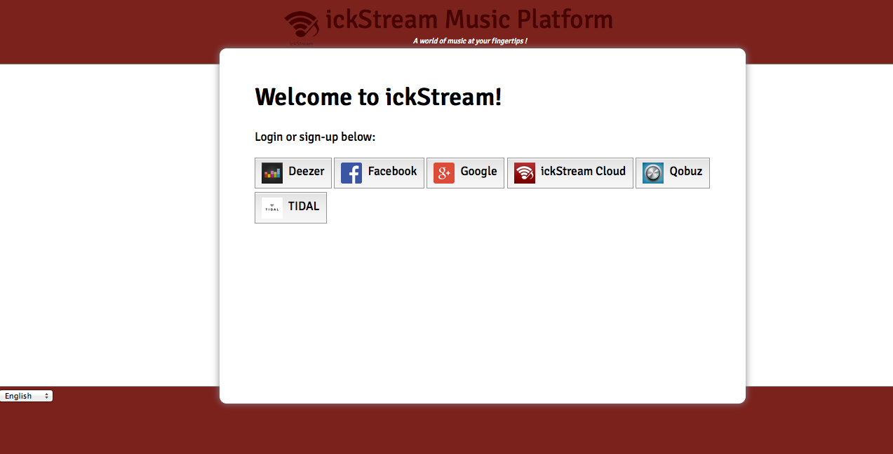
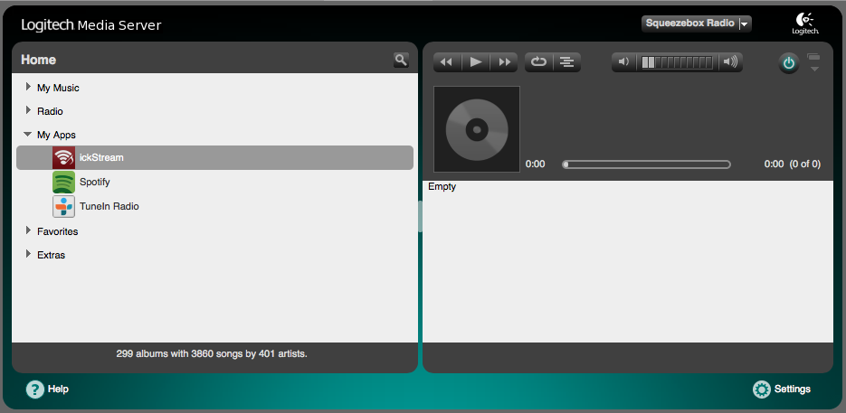

# Overview

This is the installation instructions to install ickStream Open Beta for
Squeezebox.

If you have any issues or trouble to install, please contact us via our
discussion forum and its [Squeezebox Open beta
section](http://forum.ickstream.com/viewforum.php?f=11).

# Prerequisities

To use the ickStream Open Beta for Squeezebox you will need to install
LMS (Logitech Media Server) of version 7.7.0 or later.

LMS installation packages can be found here:

  - Official production version of LMS 7.7.3 offered by Logitech:
    <http://www.mysqueezebox.com/download>
  - Community release of LMS 7.8.0 offered by Squeezebox community:
    <http://downloads.slimdevices.com/LogitechMediaServer_v7.8.0>
  - Stable community beta which eventually might be released as LMS
    7.8.1: <http://downloads.slimdevices.com/nightly/?ver=7.8>
  - Unstable community beta which eventually might be released as LMS
    7.9: <http://downloads.slimdevices.com/nightly/?ver=7.9>

Please note that the Open Beta for Squeezebox is allowed to be used for
personal use with Squeezebox hardware devices, a Squeezebox-compatible
smartphone player App or on general-purpose PCs or do-it-yourself
devices. It does explicitly NOT grant you the right to use ickStream on
any other commercial media player hardware. If you have a commercial
device contact the vendors of such hardware so they can contact us for a
commercial license.

# Installing ickStream plugin

To be able to install the ickStream plugin for LMS you first need to
setup our plugin repository.

Open the LMS web interface (http://127.0.0.1:9000 if installed on your
local computer, or replace 127.0.0.1 with the ip of the computer it is
installed on. If installed on a NAS it may also be reachable on port
9001 or 9002) and the LMS Settings/Plugins section and at the bottom of
the page specify (copy/paste) **one** of the repository urls listed
below depending on which platform you run LMS on

**General purpose PC's running Windows**

<http://repository.ickstream.com/squeezebox/repository-windows.xml>

**General purpose PC's running Linux**

<http://repository.ickstream.com/squeezebox/repository-linux.xml>

**Apple MacOSX based computer**

<http://repository.ickstream.com/squeezebox/repository-macosx.xml>

**do-it-yourself device based on older ARM CPU (for example
SheevaPlug)**

<http://repository.ickstream.com/squeezebox/repository-linuxarm.xml>

**do-it-yourself device based on newer ARM CPU (for example Raspberry Pi
or Wandboard)**

<http://repository.ickstream.com/squeezebox/repository-linuxarmhf.xml>

After setting up the plugin repository and saving the settings you will
find a **ickStream (Development versions)** section at the bottom of the
Plugins tab which contains the **ickStream** plugin. Just check the
checkbox beside it and click apply to save the settings and start the
installation.

# Confirming Terms of Use agreement

After the ickStream plugin has been installed you will need to goto LMS
Settings/Advanced/ickStream and confirm the terms of use agreement for
the Squeezebox players which are connected to your LMS server.

# Login/Register account on ickStream Music Platform

To login/register to ickStream Music Platform you have to goto LMS
Settings/Advanced/ickStream and select the **Login to ickStream Music
Platform** link. You will be able to login using your Google, Facebook
account, one of your streaming service accounts or by using the
**ickStream Cloud** login mechanism which will let you register on
ickStream using an e-mail and password of your choice. Please make sure
to use the same authentication service once you have chosen one, else
you will create multiple accounts and players may not be registered to
the intended account.

**Note\!**

If you use the TIDAL login button you will have to make sure there is an
e-mail address registered in your TIDAL account. TIDAL users without an
e-mail adress in their TIDAL account won't be able to login using TIDAL
login button and either need to add an e-mail to their TIDAL account or
need to use one of the other login methods and add TIDAL service to
their account as described in next section. This primarily affects WiMP
users who use their old WiMP account to login to TIDAL.

# Adding services to your ickStream Music Platform account

After you have registered on ickStream Music Platform you will need to
add some services to your account, this is done through our account
management application which you can reach from the links in LMS
Settings/Advanced/ickStream or by going directly to
<https://cloud.ickstream.com> with your web browser.

Login and select the **Services** section and add the services you want
to use.

Currently you might have to restart LMS for the new services to
automatically appear in the **My Apps** menu on your Squeezebox.

# Have fun and share feedback

You have now setup your Squeezebox to use ickStream Music Platform and
will be able to reach the ickStream provided content through **My
Apps/ickStream** menu on your Squeezebox.

We appreciate any feedback, both positive and negative, so we want to
encourage you to let us know what you think about ickStream Music
Platform and if you would like to see some changes. The easiest way to
provide us with feedback is to use our discussion forum and its
[Squeezebox Open beta
section](http://forum.ickstream.com/viewforum.php?f=11).